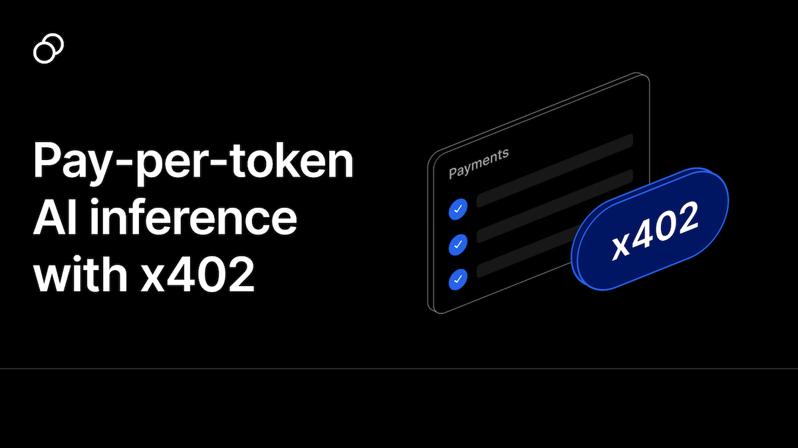

<a href="https://ai-sdk-reasoning.vercel.app/">
  
  <h1 align="center">Pay-per-Token AI Inference with x402</h1>
</a>

<p align="center">
  An open-source template demonstrating how to charge for AI inference on a <strong>pay-per-token</strong> basis using the x402 protocol.
</p>

<p align="center">
  <a href="#features"><strong>Features</strong></a> ·
  <a href="#how-it-works"><strong>How It Works</strong></a> ·
  <a href="#running-locally"><strong>Running locally</strong></a>
</p>
<br/>

## Features

### Pay-per-Token Dynamic Pricing

- **Accurate Token Metering**: Extract actual token usage from AI responses using Vercel AI SDK
- **Flexible Pricing**: Set your own price per token (ex: $0.000001 / token)
- **Real-time Cost Display**: Users see the exact cost of each AI response in the UI
- **Asynchronous Settlement**: Payment is settled after streaming completes for optimal UX

### Secure Payment Flow with x402

- **Pre-verification**: Verify signed payment data before processing requests
- **Maximum Amount Protection**: Set a max token limit to cap potential costs
- **Post-inference Settlement**: Charge only for actual tokens used
- **Onchain Payments**: Paid in the token and chain of your choice with gasless transactions

## How It Works

This template demonstrates a complete pay-per-token flow:

1. **Payment Verification** (`verifyPayment`)

   - User signs payment authorization with maximum amount
   - Server verifies signature before processing request
   - Prevents unauthorized inference calls

2. **AI Inference** (`streamText`)

   - Process chat request and stream AI response to user
   - Non-blocking payment flow ensures optimal UX
   - Extract token usage via `onFinish` callback

3. **Asynchronous Settlement** (`settlePayment`)

   - Calculate final price: `PRICE_PER_INFERENCE_TOKEN_WEI × totalTokens`
   - Settle payment on-chain after streaming completes
   - Only charge for actual tokens consumed

4. **Cost Display**
   - Stream token metadata to frontend via `messageMetadata`
   - Display cost card below each AI response
   - Full transparency for users

### Key Code Snippets

**Backend - Token Extraction & Payment Settlement** (`app/api/chat/route.ts`):

```typescript
const stream = streamText({
  // ... model config
  onFinish: async (event) => {
    const totalTokens = event.totalUsage.totalTokens;
    const finalPrice = PRICE_PER_INFERENCE_TOKEN_WEI * totalTokens;

    await settlePayment({
      facilitator: twFacilitator,
      network: arbitrum,
      price: { amount: finalPrice.toString(), asset: usdcAsset },
      // ... other params
    });
  },
});
```

**Frontend - Cost Display** (`components/messages.tsx`):

```typescript
const totalTokens = metadata?.totalTokens;
const costInUsdc = (PRICE_PER_INFERENCE_TOKEN_WEI * totalTokens) / 10 ** 6;
```

### Tech Stack

- [Next.js](https://nextjs.org) App Router for server-side rendering and performance
- [Vercel AI SDK](https://sdk.vercel.ai/docs) for LLM API and streaming
- [thirdweb x402](https://thirdweb.com/x402) for HTTP micropayments and payment infrastructure

## Running Locally

### Prerequisites

You will need the following API keys and environment variables:

- **AI Provider API Keys**: Anthropic, Fireworks, or Groq (depending on which model you want to use)
- **thirdweb Credentials**: For x402 payment infrastructure
  - Get your secret key from [thirdweb dashboard](https://thirdweb.com/dashboard)
  - Client ID for frontend wallet connection

### Setup

1. **Clone the repository**

```bash
git clone <repository-url>
cd x402-ai-inference
```

2. **Install dependencies**

```bash
pnpm install
```

3. **Set up environment variables**

Create a `.env.local` file in the root directory:

```env
# AI Provider API Keys
ANTHROPIC_API_KEY=your_anthropic_api_key

# thirdweb Configuration
THIRDWEB_SECRET_KEY=your_thirdweb_secret_key
NEXT_PUBLIC_THIRDWEB_CLIENT_ID=your_thirdweb_client_id
```

> **Important**: Never commit your `.env.local` file. It contains secrets that will allow others to control access to your AI provider and thirdweb accounts.

4. **Configure pricing** (Optional)

Edit `lib/constants.ts` to adjust your pricing:

```typescript
export const PRICE_PER_INFERENCE_TOKEN_WEI = 1; // 0.000001 USDC per token
export const MAX_INFERENCE_TOKENS_PER_CALL = 1000000; // 1M tokens max
```

You can also change the chain and token used for the payment in that file.

5. **Start the development server**

```bash
pnpm dev
```

Your app should now be running on [localhost:3000](http://localhost:3000/).

### Testing Payments

1. Connect a wallet with USDC on Arbitrum
2. Send a chat message to trigger an AI inference
3. The app will:
   - Verify your payment signature
   - Stream the AI response
   - Settle payment based on actual tokens used
   - Display the cost below the response

## Learn More

- [x402 thirdweb Documentation](https://portal.thirdweb.com/x402)

## License

This project is open source and available under the [MIT License](LICENSE).
